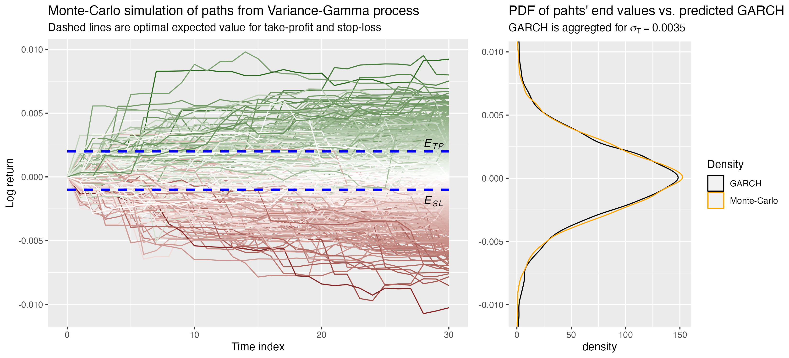

# FinStochStopLoss

<!-- badges: start -->
[](https://CRAN.R-project.org/package=FinStochStopLoss)


## Overview

The package allows to construct a stochastic stop-loss parameters for a given
conditional volatility of the underlying asset.

That is, the packages uses conditional volatility models such as GARCH, EGARCH, etc.,
to predict the future volatility of the underlying asset at time step t+1.
These models estimate how the volatility of the asset changes over time based
on past observations.

Then n-step paths are generated for the asset where
the last value of each path matches the predicted volatility from GARCH model.
These paths can be simulated using either an Ito process or a variance gamma
process, which describe the stochastic behavior of asset prices.

Optionally, these paths are improved by incorporating a jump-diffusion process.
This accounts for sudden jumps in the asset price,
in addition to the continuous stochastic process.

The simulated paths are then assessed for the statistical accuracy. This ensures
that their distribution is a "good" approximation of the future log-return
distribution of the asset. This involves comparing the simulated paths to theoretical
distributions (GARCH) and historical data.

Once the paths are statistically accurate, the stop-loss parameters can be estimated.

## Installation

You can install the package from CRAN using the following command:

```R
install.packages("FinStochStopLoss")
```


